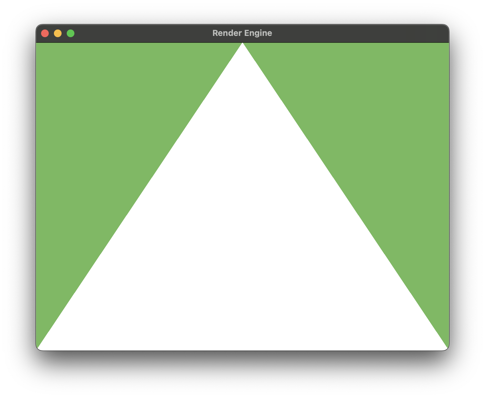
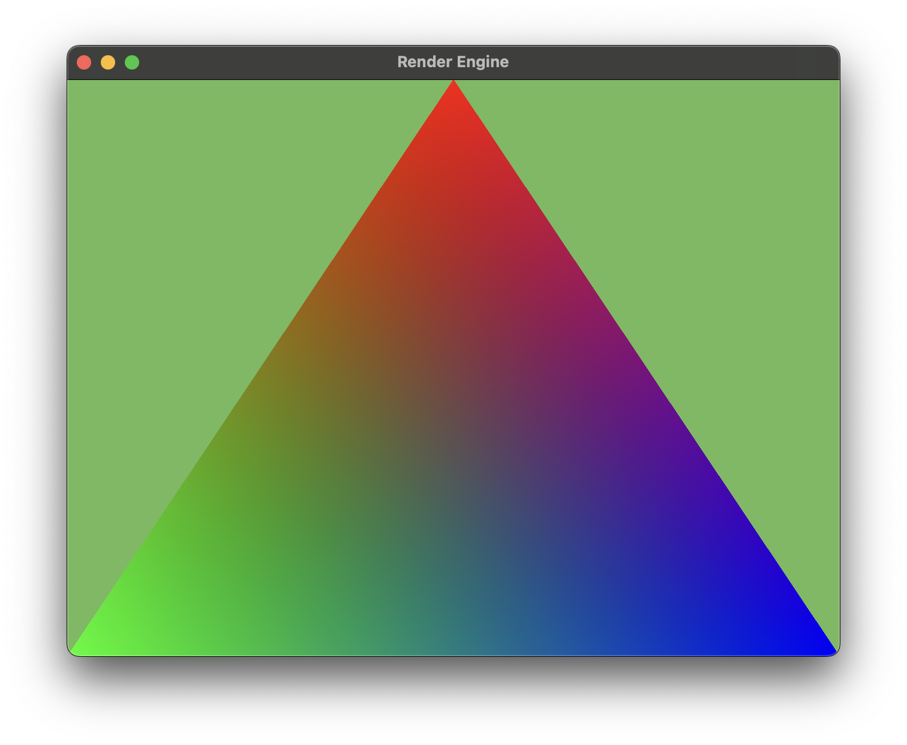

# Learning-Metal

A project in the hopes of learning how a computer prints out graphics to its user. A task complicated but so far abstracted that it seems easy

## Making a basic triangle (01/10/2023)

A triangle is a very simple thing to compute and display as it only has three vertices. We are hard-coding the triangle with an array of float3 char representing the triangles (x,y,z) coordinates. Because for now I want to do basic 2d shapes we leave the z at a constant 0. the length of the window is from -1 to 1 in both x and y. This makes it easy to make a triangle as I just, set the top as 1,0 and the other two edges as the bottom left and right.

Next I need to make a vertex buffer and also modify my function in the metal file to return the correct vertices on the screen.

This is the result

## Vertex Shaders (03/10/2023)

This is to add color. So far I have not bothered about color and with this I want to give my triangle some basic colors.
To do so I need to used the **rasterizer** function. The rasterizes tries to find any fragments that are within the triangle and
then gives the fragment an RGB color using the **fragment shader**. 

In this case I want each end point to be a color and everything in between will be a mixture of those RGB colors dependent on
how far away from each end point is the fragment.

Middle top will be red, bottom left is green, bottom right is blue and the centre is 0.3R, 0.3G, 0.3B as it is equally distant
from all points.

## Vertex Descriptors (04/10/2023)

Addition of a new file (DataTypes.swift) to include many repeated data types, assign them more readable names and using them to
clean up my code and make it more readable. I also changed the location of the Vertex struct and added some defintion in the
GameView.swift file that allows swift and metal to understand the same struct which also makes my metal code cleaner
